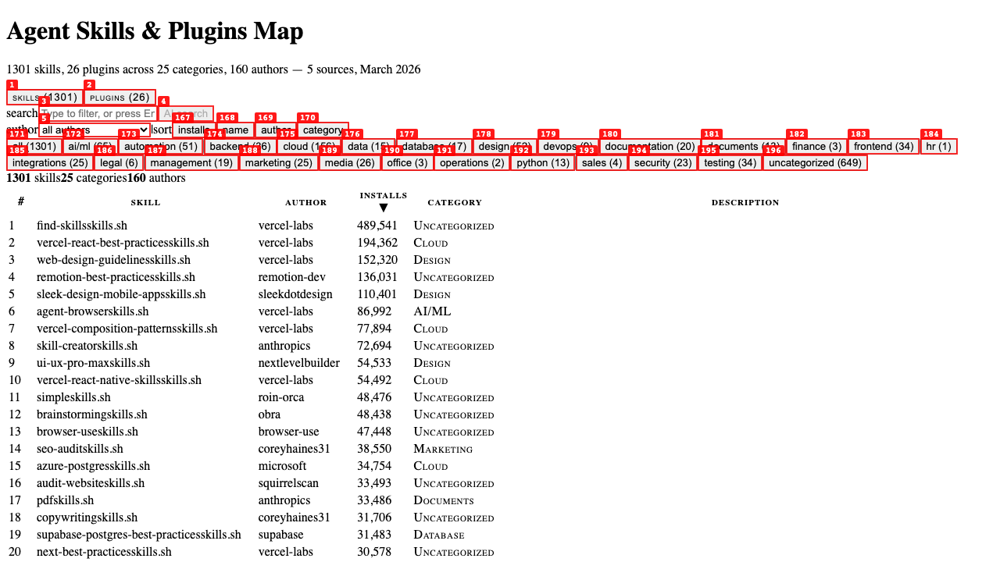
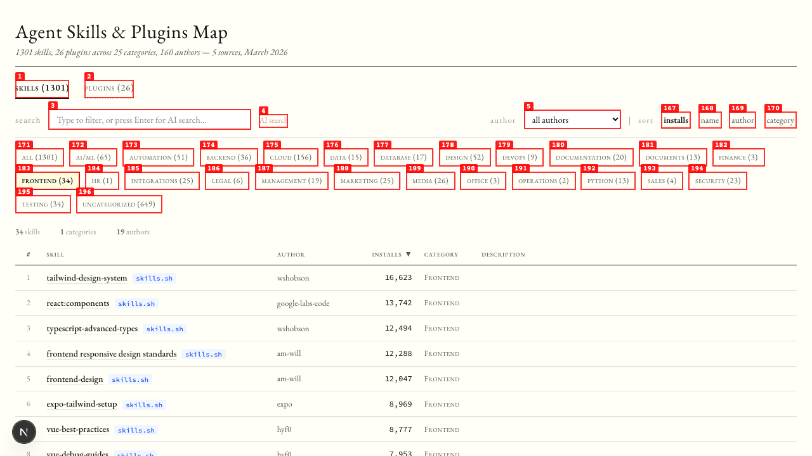
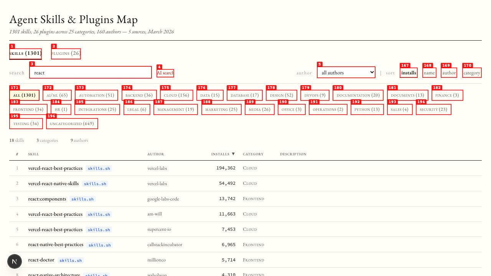
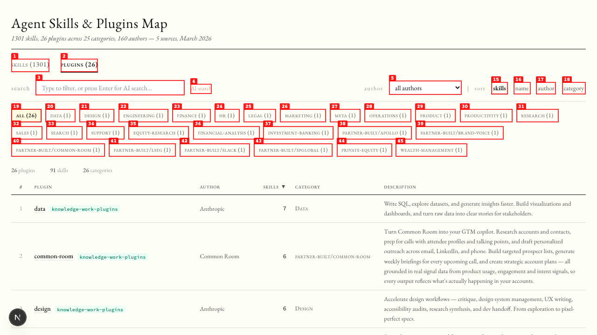

# Dogfood Report: Agent Skills & Plugins Map

| Field | Value |
|-------|-------|
| **Date** | 2026-03-11 |
| **App URL** | http://localhost:3847/ |
| **Session** | skills-map |
| **Scope** | Full app — tabs, search, filters, detail panel, plugins |

## Summary

| Severity | Count |
|----------|-------|
| Critical | 0 |
| High | 1 |
| Medium | 2 |
| Low | 2 |
| **Total** | **5** |

## Verified Working

- Tab switching (Skills <-> Plugins) works correctly
- Search text filter works (debounced, filters across name/desc/author)
- Category pills filter correctly with active state highlighting
- Sort buttons work (installs, name, author, category)
- Plugin detail panel opens with nested skills list, install command, source badge
- Skill detail panel opens with install command, GitHub link, tags
- Author dropdown filter populated correctly per tab
- Summary stats update correctly per filter state

## Issues

### ISSUE-001: Many skills lack descriptions (empty desc column)

| Field | Value |
|-------|-------|
| **Severity** | high |
| **Category** | content |
| **URL** | http://localhost:3847/ |
| **Repro Video** | N/A |

**Description**

Most skills from skills.sh (600) have empty descriptions. The scraper only gets name, author, repo, and installs from the `initialSkills` array — no descriptions or tags. This makes the table's "description" column empty for the majority of rows, significantly reducing the browsability of the catalog.

---

### ISSUE-002: 649 skills categorized as "Uncategorized"

| Field | Value |
|-------|-------|
| **Severity** | medium |
| **Category** | content |
| **URL** | http://localhost:3847/ |
| **Repro Video** | N/A |

**Description**

Nearly half (649/1301) of skills fall into "Uncategorized" category. The category inference from skill names works for some, but most VoltAgent and skills.sh entries lack enough metadata to infer a category. The "uncategorized (649)" pill dominates the category bar.

---

### ISSUE-003: Duplicate skill names from different authors

| Field | Value |
|-------|-------|
| **Severity** | medium |
| **Category** | content |
| **URL** | http://localhost:3847/ |
| **Repro Video** | N/A |

**Description**

Searching "react" shows "vercel-react-best-practices" appearing 3 times from different authors (vercel-labs, am-will, supercent-io). These are forks/copies indexed by skills.sh as separate entries. The deduplication logic keys on `author/name` so same-name skills from different authors are kept. This is technically correct but creates visual noise.

---

### ISSUE-004: Category pills don't visually distinguish active state clearly

| Field | Value |
|-------|-------|
| **Severity** | low |
| **Category** | visual |
| **URL** | http://localhost:3847/ |
| **Repro Video** | N/A |

**Description**

When a category pill is active (e.g., "FRONTEND (34)"), the visual difference from inactive pills is subtle — slightly bolder text and a solid border vs dotted. On the annotated screenshot the active pill is hard to distinguish from inactive ones without looking closely. The highlight background color defined in CSS (--color-highlight: #fffce0) may not be applying to the active pill.

---

### ISSUE-005: Plugin source badge shows only last path segment

| Field | Value |
|-------|-------|
| **Severity** | low |
| **Category** | visual |
| **URL** | http://localhost:3847/ (plugins tab) |
| **Repro Video** | N/A |

**Description**

On the plugins tab, the source badge shows "knowledge-work-plugins" (last segment of `anthropics/knowledge-work-plugins`) which is long and truncates. The full source path would be more useful but even longer. Consider abbreviating to "anthropic" or "anthro-kwp" for better readability.

---
